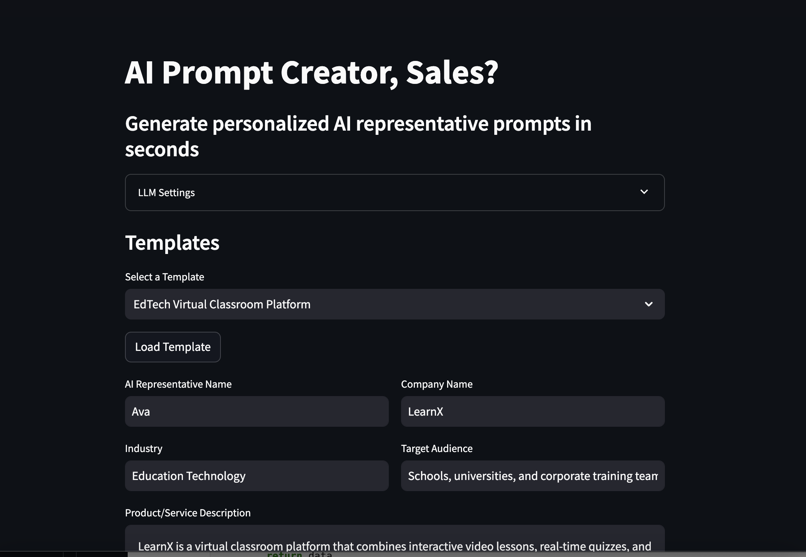

# AI Sales Prompt Creator

AI Sales Prompt Creator is a Streamlit application designed to generate personalized AI representative prompts in seconds. The app allows users to input various details about their product or service, select predefined templates, and generate AI prompts tailored to their needs, such as sales or support AI agents. This project is heavily inspired by [sales-prompt-creator](https://github.com/askjohngeorge/sales-prompt-creator).



## Features

- **Template Loading**: Choose from a set of predefined templates to auto-populate fields like AI name, industry, company name, and more.
- **Custom Input Fields**: Input specific details about your product, target audience, challenges solved, objections, and call objectives.
- **AI Prompt Generation**: Generate a fully personalized AI representative prompt based on the provided inputs.
- **Local Model Support**: Works out of the box with local models like Ollama for offline AI prompt generation.
- **Powered by LangChain**: Leverages the LangChain framework for advanced prompt generation capabilities.

## Demo

Check out the live demo: [AI Sales Prompt Creator Demo](https://steinathan-ai-sales-prompt-creator-main-l6nnsn.streamlit.app/)

## Installation

To run this app locally, follow these steps:

### Prerequisites

Ensure you have the following installed:

- Python (version 3.11 or later)
- Streamlit
- Ollama (for local model support)

### Step 1: Clone the repository

```bash
git clone https://github.com/steinathan/ai-sales-prompt-creator.git
cd ai-sales-prompt-creator
```

### Step 2: Install dependencies

Install the required Python packages using pip:

```bash
uv sync
```

### Step 2: Install Ollama

Follow the instructions on the [Ollama website](https://ollama.com) to install and set up Ollama on your local machine.

### Step 3: Run the application

Start the Streamlit application:

```bash
streamlit run main.py
```

## Usage

1. Open your web browser and navigate to `http://localhost:8501`.
2. Fill in the input fields with the relevant details about your product or service.
3. Select a predefined template or customize the input fields as needed.
4. Click the "Generate Prompt" button to create your personalized AI representative prompt.
5. Copy the generated prompt and use it in your sales or support interactions.

## Contributing

We welcome contributions to improve the AI Sales Prompt Creator. To contribute:

1. Fork the repository.
2. Create a new branch for your feature or bugfix.
3. Commit your changes and push the branch to your fork.
4. Open a pull request with a detailed description of your changes.

## License

This project is licensed under the MIT License. See the [LICENSE](LICENSE) file for more details.

## Contact

For questions or feedback, please reach out to us at [navicsteinrotciv@gmail.com](mailto:navicsteinrotciv@gmail.com).
